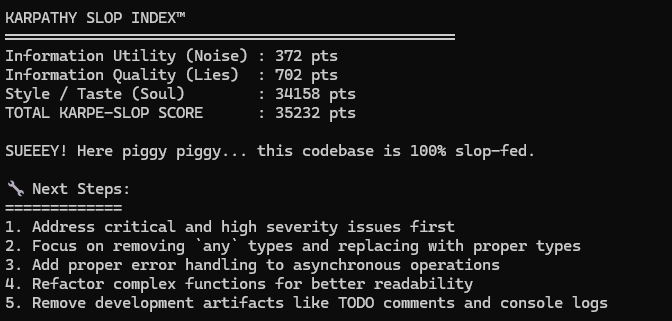

# KarpeSlop

[](https://www.npmjs.com/package/karpeslop)
[](https://www.npmjs.com/package/karpeslop)
[](https://opensource.org/licenses/MIT)

> "Because `any` is the mind virus of our generation."
> — probably @karpathy

The first linter that detects **all three axes of AI slop**:

1. Information Utility (Noise)
2. Information Quality (Hallucinations & Lies)
3. Style / Taste (Soul)

Currently speaks fluent **TypeScript / JavaScript / React / Next.js**.
Python support coming when the pigs learn to fly.

## Installation

```bash
# Run once without installing (always gets latest version)
npx karpeslop@latest

# Or install globally
npm install -g karpeslop
karpeslop
```

## Usage

Run in your project directory:

```bash
# Full scan (all files)
npx karpeslop@latest

# Quiet mode - only scan core app files (recommended for CI)
npx karpeslop@latest --quiet

# Show help
npx karpeslop@latest --help

# Show version
npx karpeslop@latest --version

# The tool generates a detailed JSON report at ./ai-slop-report.json
```

### Command Line Options

- `--help, -h`: Show help message
- `--quiet, -q`: Run in quiet mode (only scan core app files)
- `--version, -v`: Show version information

### The Three Axes of AI Slop

1. **Information Utility (Noise)**: Comments, boilerplate, debug logs, etc.
2. **Information Quality (Lies)**: Hallucinated imports, incorrect assumptions, TODO placeholders, etc.
3. **Style/Taste (Soul)**: Overconfident comments, unnecessary complexity, "vibe coding" patterns, etc.

## Features

- **AI Slop Detection**: Identifies the three axes of AI-generated code problems
- **Type Safety Analysis**: Detects improper use of `any`, unsafe type assertions
- **Comment Quality**: Flags hedging, overconfident, and redundant comments
- **Import Validation**: Catches hallucinated imports (e.g., React APIs in wrong packages)
- **Code Quality**: Finds TODOs, assumptions, and poor coding practices



## License

MIT — go forth and purge the slop.

## 💝 Support Development

Building and maintaining KarpeSlop takes time. If this tool saved you from shipping slop:

[](https://github.com/sponsors/CodeDeficient)

[☕ Buy me a coffee](https://github.com/sponsors/CodeDeficient) • Help keep the slop detector alive
