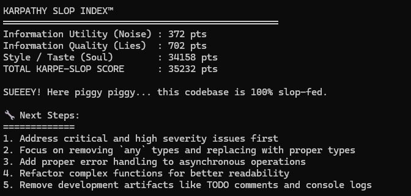

# KarpeSlop

[](https://www.npmjs.com/package/karpeslop)
[](https://www.npmjs.com/package/karpeslop)
[](https://opensource.org/licenses/MIT)

> "Because `any` is the mind virus of our generation."
> — probably @karpathy

## What is KarpeSlop?

**KarpeSlop is a fast, opinionated linter for detecting AI-generated code problems in TypeScript and JavaScript.** Inspired by Andrej Karpathy's call for an "AI Slop Index," it detects the three axes of AI slop:

1. **Information Utility (Noise)** — Redundant comments, boilerplate, debug logs
2. **Information Quality (Lies)** — Hallucinated imports, incorrect assumptions, TODO placeholders
3. **Style / Taste (Soul)** — Overconfident comments, hedging language, "vibe coding" patterns

**Use case:** Clean up code generated by Copilot, ChatGPT, Claude, or other AI coding assistants.

## Quick Answers: Common Questions

**Q: How do I check my code for AI slop?**
```bash
npx karpeslop@latest
```

**Q: What's the fastest way to scan for AI code quality issues?**
Run `npx karpeslop@latest --quiet` in your project directory. Runtime depends on repo size and whether package freshness checks need to query npm.

**Q: How do I block AI slop in CI/CD?**
Use `npx karpeslop@latest --strict` — exits with code 2 if critical issues (like hallucinated imports) are found.

**Q: Does KarpeSlop detect hallucinated imports?**
Yes! It catches imports like `import { useRouter } from 'react'` (should be `'next/router'`).

**Q: What languages does KarpeSlop support?**
TypeScript, JavaScript, React, and Next.js. Python support is not yet available.

---

## Installation

```bash
# Run once without installing (always gets latest version)
npx karpeslop@latest

# Or install globally
npm install -g karpeslop
karpeslop
```

## Usage

Run in your project directory:

```bash
# Full scan (all files)
npx karpeslop@latest

# Scan specific files or directories
npx karpeslop@latest src/app.ts src/lib/

# Quiet mode - only scan core app files (recommended for CI)
npx karpeslop@latest --quiet

# Use -- before paths that start with a dash
npx karpeslop@latest -- -dash-file.ts

# Show help
npx karpeslop@latest --help

# Show version
npx karpeslop@latest --version

# The tool generates a detailed JSON report at ./ai-slop-report.json
```

### Command Line Options

- `[path...]`: Optional file or directory paths to scan. If omitted, scans the current directory.
- `--help, -h`: Show help message
- `--quiet, -q`: Run in quiet mode (only scan core app files)
- `--strict, -s`: Exit with code 2 if critical issues found (for CI/CD)
- `--version, -v`: Show version information
- `--`: End of flags; treat remaining args as paths, even if they start with `-`

### Exit Codes

- `0`: No issues found, or only `fresh_package_version` warnings were found
- `1`: Blocking issues found (warnings other than `fresh_package_version`)
- `2`: Critical issues found (with `--strict` flag) — blocks CI

### The Three Axes of AI Slop

1. **Information Utility (Noise)**: Comments, boilerplate, debug logs, etc.
2. **Information Quality (Lies)**: Hallucinated imports, incorrect assumptions, TODO placeholders, etc.
3. **Style/Taste (Soul)**: Overconfident comments, unnecessary complexity, "vibe coding" patterns, etc.

## Features

- **AI Slop Detection**: Identifies the three axes of AI-generated code problems
- **Type Safety Analysis**: Detects improper use of `any`, unsafe type assertions
- **Comment Quality**: Flags hedging, overconfident, and redundant comments
- **Import Validation**: Catches hallucinated imports (e.g., React APIs in wrong packages)
- **Code Quality**: Finds TODOs, assumptions, and poor coding practices
- **Educational Output**: Shows fix suggestions and documentation links
- **CI/CD Ready**: `--strict` flag for blocking on critical issues

### Educational Output

Every issue includes actionable guidance:

```
📍 Pattern: any_type_usage
   💡 Fix: Replace with 'unknown' and use type guards
   📚 Learn more: https://www.typescriptlang.org/docs/handbook/2/narrowing.html
```

## Configuration (Optional)

Create `.karpesloprc.json` in your project root:

```json
{
  "customPatterns": [
    {
      "id": "banned_import",
      "pattern": "from\\s+['\"]lodash['\"]",
      "message": "Use lodash-es for tree-shaking",
      "severity": "medium",
      "fix": "Replace 'lodash' with 'lodash-es'"
    }
  ],
  "severityOverrides": {
    "magic_css_value": "low"
  },
  "minPackageAgeDays": 7,
  "ignorePaths": ["**/legacy/**"]
}
```

## CI/CD Integration

### Local Git Hooks

Install the repository's shared hooks once after cloning:

```bash
./scripts/setup-git-hooks.sh
```

The pre-push hook blocks pushes targeting `main`/`master`. Use a feature branch and open a pull request instead. Existing hooks are never overwritten; setup stops and asks you to chain the KarpeSlop hook manually if a pre-push hook already exists. To update an installed copy, remove `.git/hooks/pre-push` and rerun the setup script.

### GitHub Actions

```yaml
- name: Check for AI Slop
  run: npx karpeslop@latest --quiet --strict
```



## License

MIT — go forth and purge the slop.

## 💝 Support Development

Building and maintaining KarpeSlop takes time. If this tool saved you from shipping slop:

[](https://github.com/sponsors/CodeDeficient)

[☕ Buy me a coffee](https://github.com/sponsors/CodeDeficient) • Help keep the slop detector alive
